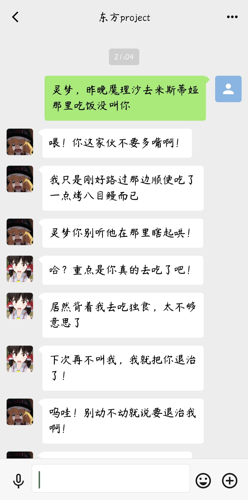
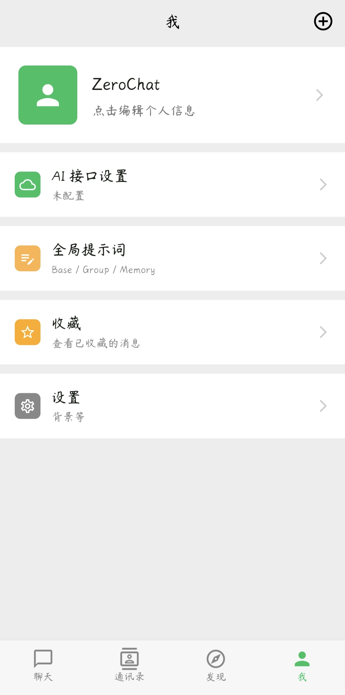
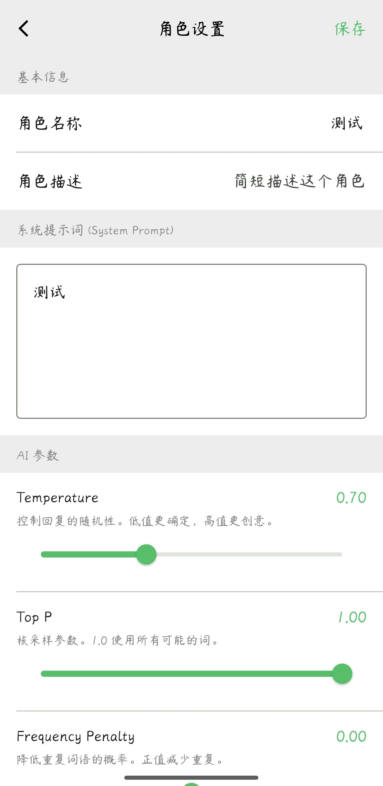
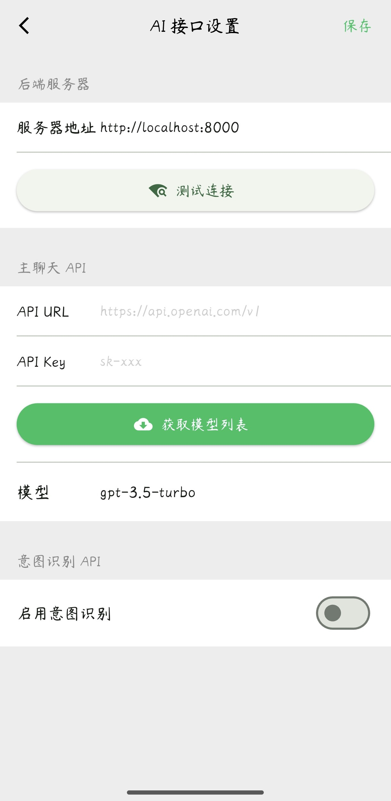
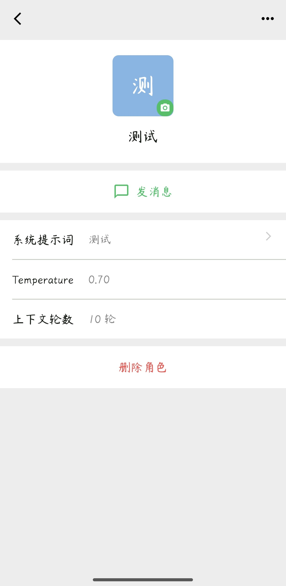
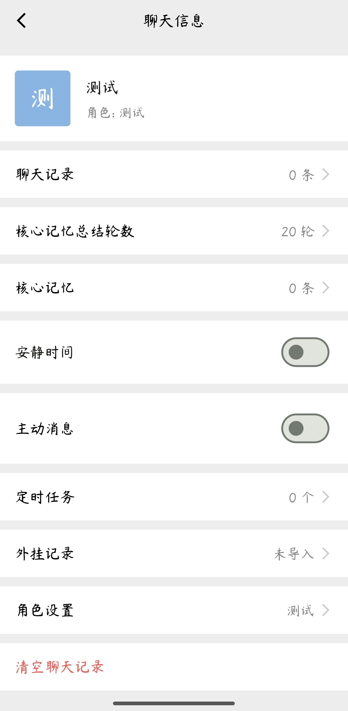
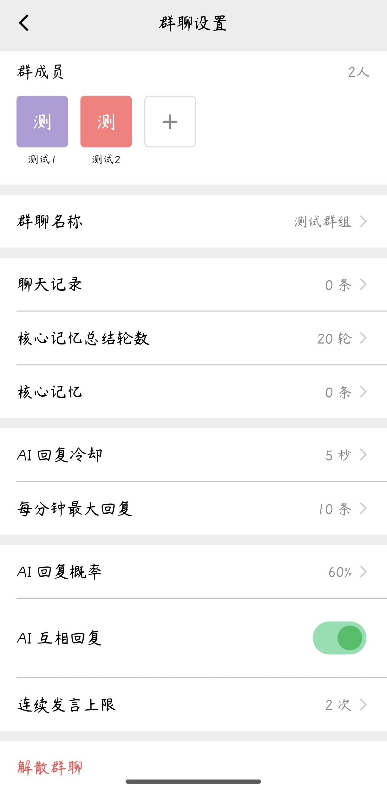

# ZeroChat 🤖💬

> 一款模拟微信界面的 AI 聊天伴侣 Flutter 应用，支持多角色 AI 对话、AI 朋友圈、主动消息、定时任务等丰富功能。
> 本仓库Fork自[sh1nny0u/ZeroChat](https://github.com/sh1nny0u/ZeroChat),并对记忆，表情等功能做了技术修改


---     
## 📋 功能概览
    部分内容参考了https://github.com/KouriChat/KouriChat
### 💬 AI 聊天
- **多角色对话** — 创建多个 AI 角色，每个角色拥有独立人设、记忆和系统提示词
- **分段发送** — AI 回复自动分段，模拟真人打字节奏
- **表情包系统** — AI 根据情绪自动发送表情包（支持自定义表情包文件夹）
- **核心记忆** — AI 记住用户的重要信息，跨对话持久化
- **短期记忆** — AI 维护对话上下文，自动总结长对话
- **图片识别** — 发送图片给 AI，支持 Vision API 识别图片内容
- **外挂记录** — 支持json、txt等文本文件加载至角色信息中，该文本信息与聊天记录同级发送（即可以加载其他渠道的聊天记录等）

### 👥 群聊
- **多角色群聊** — 创建包含多个 AI 角色的群聊
- **AI ↔ AI 互动** — AI 角色之间可以互相对话
- **独立配置** — 每个群聊可单独配置参与角色和行为

### 📱 朋友圈
- **AI 自动发布** — AI 角色按调度自动发布朋友圈动态
- **互动系统** — 支持点赞、评论、回复评论
- **AI 互动** — AI 角色会自动点赞和评论其他帖子
- **朋友圈感知** — 聊天中 AI 会感知朋友圈动态，自然提及

### ⏰ 主动消息 & 定时任务
- **主动消息** — AI 角色在随机间隔后主动发送消息
- **安静时间** — 设置免打扰时段，AI 不会在此期间发消息
- **定时任务** — 设置定时提醒，AI 以角色身份发送提醒消息
- **冷启动补偿** — 应用重启后自动补发已过期的消息

### 🎨 界面
- **微信风格 UI** — 完整复刻微信界面：聊天列表、通讯录、朋友圈、个人主页
- **背景** — 支持聊天背景和朋友圈封面图修改
- **收藏功能** — 收藏消息，支持分类浏览

### ⚙️ 可配置性
- **全局 Base Prompt** — 统一设置所有角色共用的基础提示词
- **角色级配置** — 每个角色独立配置：温度、频率惩罚、存在惩罚、最大上下文轮数
- **API 设置** — 支持 OpenAI 兼容的任意 API（如 DeepSeek、Claude 等）
- **前后端同步** — 角色数据、消息、记忆自动同步到后端

---

## 🏗 架构

```
zerochat/
├── lib/                        # Flutter 前端
│   ├── main.dart               # 应用入口
│   ├── core/                   # 核心逻辑
│   │   ├── chat_controller.dart    # 聊天控制器（核心）
│   │   ├── message_store.dart      # 消息存储
│   │   ├── moments_scheduler.dart  # 朋友圈调度器
│   │   ├── proactive_message_scheduler.dart  # 主动消息调度
│   │   ├── group_scheduler.dart    # 群聊调度
│   │   ├── memory_manager.dart     # 记忆管理
│   │   └── segment_sender.dart     # 分段发送工具
│   ├── models/                 # 数据模型
│   ├── pages/                  # 页面（21个）
│   ├── services/               # 服务层（15个）
│   └── widgets/                # 自定义组件
│
└── server/                     # FastAPI 后端
    ├── main.py                 # 服务入口
    ├── requirements.txt        # Python 依赖
    ├── start.bat               # 一键启动脚本（Windows）
    ├── routers/                # API 路由
    │   ├── ai_behavior.py      # AI 行为统一入口
    │   ├── chat.py             # 聊天 API
    │   ├── roles.py            # 角色管理 API
    │   ├── moments.py          # 朋友圈 API
    │   ├── tasks.py            # 定时任务 API
    │   └── settings.py         # 设置 API
    └── services/               # 后端服务
        ├── ai_service.py       # AI 调用服务
        ├── memory_service.py   # 记忆管理
        ├── scheduler_service.py # 调度器服务
        └── settings_service.py # 配置管理
```

---

## 🚀 快速开始

### 方式一：傻瓜部署（推荐）

> 无需安装 Flutter 或任何开发工具，适合普通用户。

#### 你需要准备

| 材料 | 说明 |
|------|------|
| **ZeroChat.apk** | 安卓安装包，直接安装到手机 |
| **zerochat-server.zip** | 后端压缩包，解压到服务器即可运行 |
| **一台服务器**（或本机） | 需要预装 Python 3.11+，详见下方"没有云服务器？"章节 |
| **AI API Key** | 支持 OpenAI 兼容 API（如 DeepSeek、通义千问等） |

#### 📦 压缩包内容（zerochat-server.zip）

```
zerochat-server/
├── main.py                 # 后端入口
├── requirements.txt        # Python 依赖
├── start.bat               # Windows 一键启动
├── start.sh                # Linux/Mac 一键启动
├── routers/                # API 路由（6 个 .py + __init__.py）
│   ├── __init__.py
│   ├── ai_behavior.py
│   ├── chat.py
│   ├── moments.py
│   ├── roles.py
│   ├── settings.py
│   └── tasks.py
└── services/               # 后端服务（6 个 .py + __init__.py）
    ├── __init__.py
    ├── ai_service.py
    ├── memory_service.py
    ├── scheduler_service.py
    ├── search_service.py
    └── settings_service.py
```

#### 步骤

**1. 部署后端**

```bash
# 1. 将 zerochat-server.zip 上传到服务器并解压
unzip zerochat-server.zip
cd zerochat-server

# 2. 启动服务（首次运行自动创建虚拟环境和安装依赖）
# Windows:
start.bat
# Linux/Mac:
chmod +x start.sh && ./start.sh
```

启动后访问 `http://服务器IP:8000` 确认服务正常。

**2. 安装 APK**
- 将 `ZeroChat.apk` 传到手机，直接安装
- 打开应用，进入 **我 → AI 接口设置**

**3. 配置连接**

| 设置项 | 示例值 | 说明 |
|--------|--------|------|
| API URL | `https://api.deepseek.com/v1/chat/completions` | AI 服务 API 地址 |
| API Key | `sk-xxxxxxxxxxxxxxxx` | 你的 API 密钥 |
| 模型 | `deepseek-chat` | 模型名称 |
| 后端地址 | `http://你的服务器IP:8000` | ZeroChat 后端地址 |

---

### 🌐 没有云服务器？

以下方案让你无需购买云服务器，也能让手机连接到电脑上运行的后端：

#### 方案一：同一 WiFi 局域网（最简单）

手机和电脑连同一个 WiFi，在电脑上启动后端后：

```
后端地址填写: http://电脑局域网IP:8000
```

> 查看电脑 IP：Windows 打开 CMD 输入 `ipconfig`，找到 `IPv4 地址`（通常是 `192.168.x.x`）

#### 方案二：内网穿透（手机不在同一网络）

使用内网穿透工具将本地 8000 端口暴露到公网：

| 工具 | 特点 | 命令示例 |
|------|------|----------|
| [**cpolar**](https://www.cpolar.com/) | 国内速度快，免费版够用 | `cpolar http 8000` |
| [**ngrok**](https://ngrok.com/) | 全球流行，免费版有限 | `ngrok http 8000` |
| [**frp**](https://github.com/fatedier/frp) | 自建服务器，完全掌控 | 需自行配置 |
| [**花生壳**](https://hsk.oray.com/) | 国内免费 DDNS | 需注册 |
| [**SakuraFrp**](https://www.natfrp.com/) | 操作简单，支持建站，价格相对便宜 | 需注册，有一定成本 |

运行穿透工具后，会得到一个公网地址（如 `https://xxx.cpolar.top`），将其填入应用的"后端地址"即可。

#### 方案三：Android 模拟器（开发调试）

如果用 Android 模拟器，后端地址填写：
```
http://10.0.2.2:8000
```
> `10.0.2.2` 是 Android 模拟器访问宿主机的特殊 IP。

---

### 方式二：开发者部署（从源码构建）

> 适合想修改代码或参与开发的用户。

#### 前提条件

| 工具 | 版本 | 说明 |
|------|------|------|
| Flutter | 3.x+ | [安装指南](https://docs.flutter.dev/get-started/install) |
| Python | 3.11+ | [下载](https://www.python.org/downloads/) |
| Android Studio / VS Code | 最新版 | Flutter IDE |
| AI API Key | - | 支持 OpenAI 兼容 API |

```bash
# 1. 启动后端
cd server
start.bat          # Windows
# 或: chmod +x start.sh && ./start.sh  # Linux/Mac

# 2. 启动前端
flutter pub get
flutter run
```

在应用内进入 **我 → AI 接口设置**，配置 API URL、API Key、模型和后端地址。

---

## 📱 截图

<p align="center">
  
  
  
</p>

<p align="center">
  
  
  
  
</p>

---
## 已知BUG：
- 在后端AI生成回复后退出会导致生成中断，返回失败
- 受前端限制以及个人能力影响，下述bug虽已定位或在后端修改，但无法同步到前端
  - 表情包功能无法拓展更多类型的表情，且已有表情中surprised类别无法正常发送（前端surprised错误拼写为了suprised）
  - 主动聊天功能虽已在后端修改，但因前端并未调用定义好的后端接口，更改无法生效（当前生成主动聊天内容时不参考前后文，容易导致内容严重割裂）
  - 记忆功能前后端并未同步（但仅影响主动聊天部分记忆，被动聊天部分不受影响）
  - 记忆功能未对群聊场景进行适配
  - 部分新增功能并未在前端有设置UI，只能手动在后端文件中进行修改

---
## 当前技术修改：
- 将记忆存储格式从json改为sqlite
- 将表情功能触发方式从匹配固定关键词改为调用AI判断，并限制进行判断的概率为25%（需要手动配置data/roles/1000000000001/profile.json中的API_KEY）
- 将记忆截取方式从固定抛弃最旧消息改为滑动窗口（以适配deepseek的缓存功能，降低开销），并引入以下机制
  - 核心记忆总结助手（需要手动配置data/roles/1000000000000/profile.json中的API_KEY）：将核心记忆总结拆分出来，允许自选模型，以降低开销（由于前端限制，目前前端仍会自己总结）
  - 事件总结助手（需要手动配置data/roles/1000000000002/profile.json中的API_KEY）：总结上一个记忆窗口中的内容，避免出现记忆断层（同样允许自选模型）
  - 衔接事件生成助手（需要手动配置data/roles/1000000000002/profile.json中的API_KEY）：当你在在对话的事件并未完成时突然有其他事要忙，下次对话时会在两次对话中插入合理的过度事件
- 为女性角色添加“月经事件”以增强真实性（需要手动修改对应角色的profile，将“gender”修改为“women”以开启功能）
## 未来技术修改方向：
- [ ]修复记忆功能对群聊的支持                                                            
- [ ]将记忆窗口从固定长度改为由AI判断，避免在一个事件中切换记忆窗口导致上下文出现割裂感       
- [ ]支持指定前置模型完成图片识别任务，以适配deepseek等不支持视觉的模型

---           
## 🤝 贡献

欢迎提交 Issue 和 Pull Request！

## 📄 许可证

MIT License


