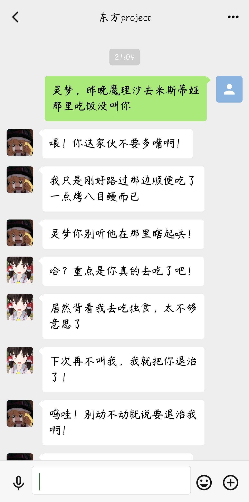
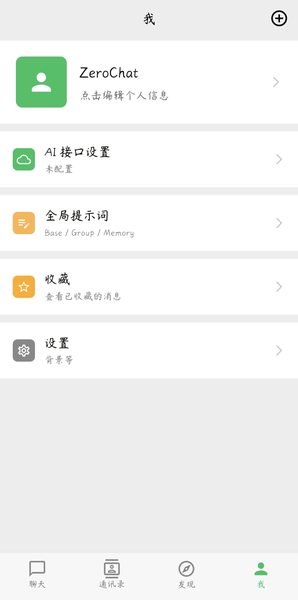
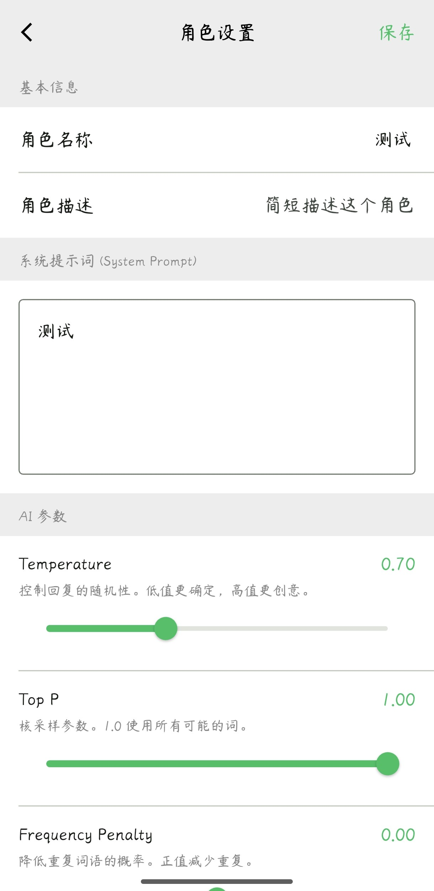
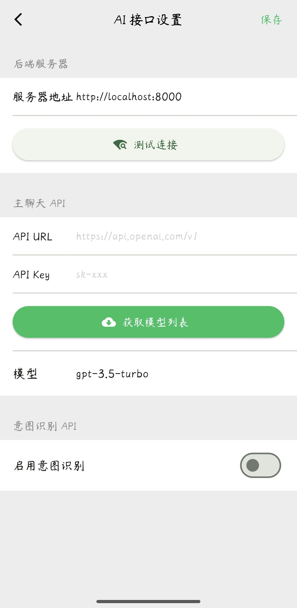
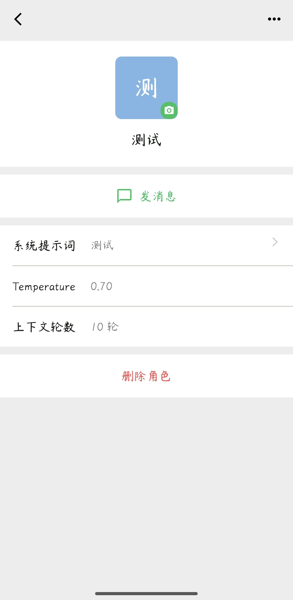
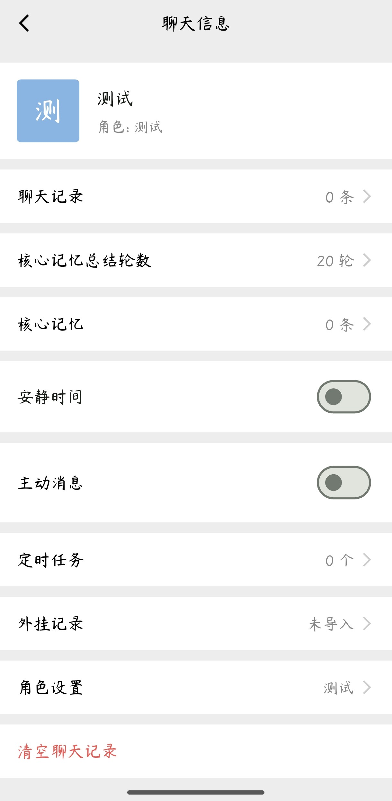
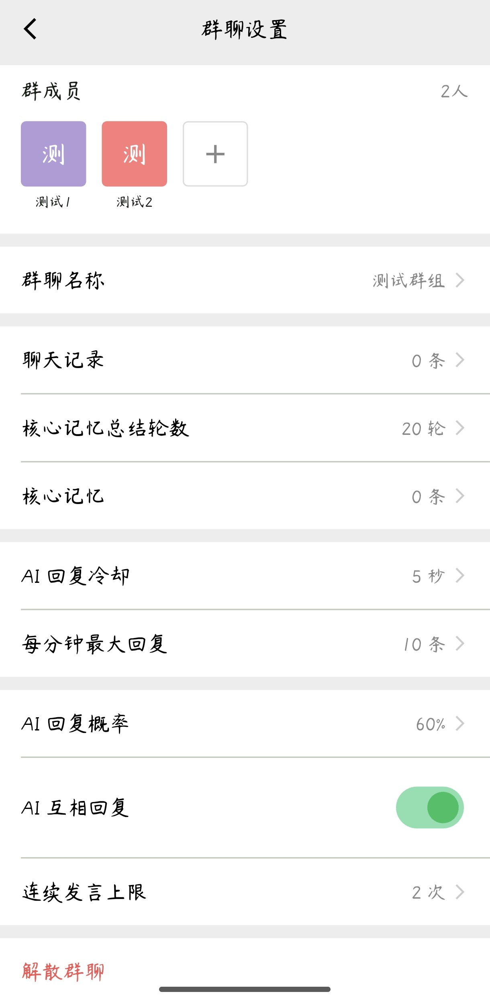

# ZeroChat 🤖💬

> 一款模拟微信界面的 AI 聊天伴侣应用，支持多角色 AI 对话、朋友圈社交、主动消息、定时任务、QQ 接入等丰富功能。
>
> 本仓库 Fork 自 [sh1nny0u/ZeroChat](https://github.com/sh1nny0u/ZeroChat)，在原作基础上对记忆系统、表情机制、后端架构等进行了深度重构与扩展。


---

## 📋 功能概览

### 💬 AI 聊天

- **多角色对话** — 创建多个 AI 角色，每个角色拥有独立人设、记忆和系统提示词
- **分段发送** — AI 回复自动按 `$` 符号分段，模拟真人打字节奏与延迟
- **情感表情系统** — AI 根据对话情绪自动选择匹配的表情包（支持自定义表情文件夹）
- **图片识别** — 发送图片给 AI，支持 Vision API 识别图片内容，可指定前置模型处理
- **外挂记录** — 支持 JSON、TXT 等文本文件加载至角色信息中，与聊天记录同级发送

### 👥 群聊

- **多角色群聊** — 创建包含多个 AI 角色的群聊，AI 角色之间可互相对话
- **关键词触发** — AI 根据消息内容中的关键词自动决定是否参与回复
- **独立配置** — 每个群聊可单独配置参与角色和行为参数

### 📱 朋友圈（Moments）

- **AI 自动发布** — AI 角色按调度自动发布朋友圈动态
- **互动系统** — 支持点赞、评论、回复评论，AI 角色会自动互动
- **朋友圈感知** — 聊天中 AI 会感知朋友圈动态并在对话中自然提及

### ⏰ 主动消息 & 定时任务

- **主动消息** — AI 角色在随机间隔后主动发送消息，模拟真人聊天节奏
- **安静时间** — 设置免打扰时段，AI 不会在此期间发消息
- **定时任务** — AI 在对话中通过 Function Calling 自主创建定时提醒
- **冷启动补偿** — 应用重启后自动补发已过期的消息

### 🔌 OneBot QQ 集成

- **QQ 协议接入** — 通过 OneBot V11 协议（NapCat 框架）连接 QQ，支持群聊/私聊
- **双传输模式** — 支持 HTTP POST 事件推送与反向 WebSocket 连接
- **消息聚合** — 15 秒消息聚合窗口，合并连续短消息减少 AI 调用次数
- **用户屏蔽** — AI 可通过 Function Calling 自主屏蔽骚扰用户

### 🧠 记忆系统

- **三层架构**：
  - **核心记忆** — AI 自主总结的用户重要信息，跨对话持久化
  - **短期记忆** — 滑动窗口上下文，适配 DeepSeek 缓存机制降低开销
  - **向量记忆** — 基于 Embedding（BAAI/bge-m3）的语义检索，实现长期精准召回
- **助手模型分流** — 核心记忆总结、事件总结、衔接事件生成均可指定独立模型，降低主模型开销
- **自动总结** — 核心记忆总结助手、事件总结助手、衔接事件生成助手三大 AI 模块协同工作

### 🎨 界面

- **微信风格 UI** — 完整复刻微信界面：聊天列表、通讯录、朋友圈、个人主页
- **自定义背景** — 支持聊天背景和朋友圈封面图修改
- **收藏功能** — 收藏消息，支持分类浏览

### ⚙️ 可配置性

- **全局 Base Prompt** — 统一设置所有角色共用的基础提示词
- **角色级配置** — 温度、频率惩罚、存在惩罚、最大上下文轮数等独立配置
- **多模型支持** — 支持为对话、意图识别、视觉理解、Embedding 分别指定不同的 API 和模型
- **前后端同步** — 角色数据、消息、记忆通过 WebSocket 实时同步

### 🔐 安全传输

- **Token 鉴权** — 全量 API 请求头携带 `X-Auth-Token`
- **AES 加密** — JSON 请求/响应体加密传输，WebSocket 帧级加密
- **可配置密钥** — 鉴权 Token 和加密密钥均可通过服务端配置文件修改

---

## 🏗 架构

```
zerochat/
├── client/                          # Flutter 跨平台前端
│   └── lib/
│       ├── main.dart                # 应用入口
│       ├── core/                    # 核心业务逻辑
│       │   ├── chat_controller.dart         # 聊天引擎（消息流转、AI 调度、分段发送）
│       │   ├── memory_manager.dart          # 记忆管理（自动总结与更新）
│       │   ├── message_store.dart           # 消息存储（流订阅、持久化、后端同步）
│       │   ├── group_scheduler.dart         # 群聊发言调度
│       │   ├── moments_scheduler.dart       # 朋友圈调度（发布、互动、回复）
│       │   ├── proactive_message_scheduler.dart  # 主动消息调度
│       │   └── segment_sender.dart          # 分段发送工具
│       ├── models/                  # 数据模型（12个）
│       ├── pages/                   # UI 页面（19个）
│       ├── services/                # 服务层（22个）
│       │   ├── api_service.dart             # REST API 客户端
│       │   ├── secure_websocket_client.dart  # 加密 WebSocket 客户端
│       │   ├── secure_backend_client.dart    # 加密 HTTP 客户端（AES）
│       │   ├── realtime_sync_service.dart    # WebSocket 实时同步
│       │   ├── memory_service.dart          # 记忆管理服务
│       │   ├── background_runtime_service.dart   # 后台保活与调度
│       │   ├── notification_service.dart    # 本地通知
│       │   └── ...（14个更多服务）
│       └── widgets/                 # 可复用 UI 组件（4个）
│
└── server/                          # FastAPI 后端
    ├── main.py                      # 服务入口
    ├── requirements.txt             # Python 依赖
    ├── start.bat / start.sh         # 一键启动脚本
    ├── config/
    │   └── settings.json            # 运行时配置（API 密钥、Token、加密密钥等）
    ├── core/                        # 核心基础设施
    │   ├── lifecycle.py             # 启动/关闭生命周期钩子
    │   ├── middleware.py            # 中间件（请求日志、安全鉴权）
    │   └── utils.py                 # 共享工具函数
    ├── routers/                     # API 路由（7个）
    │   ├── ai_behavior.py           # AI 行为统一入口（聊天/主动消息/任务/朋友圈）
    │   ├── chat.py                  # 聊天消息 API
    │   ├── roles.py                 # 角色 CRUD API
    │   ├── moments.py               # 朋友圈 API
    │   ├── tasks.py                 # 定时任务 API
    │   ├── settings.py              # 设置 API
    │   └── onebot.py                # OneBot V11 QQ 协议适配
    ├── services/                    # 业务逻辑服务（8个）
    │   ├── ai_service.py            # AI API 调用（OpenAI 兼容 + Embedding）
    │   ├── ai_tools.py              # AI Function Calling 工具（schedule_task, block_user）
    │   ├── memory_service.py        # 记忆存储（SQLite）
    │   ├── vector_memory.py         # 向量记忆（语义检索）
    │   ├── scheduler_service.py     # APScheduler 任务调度
    │   ├── search_service.py        # 联网搜索（DuckDuckGo）
    │   ├── settings_service.py      # 配置管理
    │   └── security_service.py      # 认证与加密
    └── transport/                   # 传输层（5个）
        ├── ws_endpoint.py           # 安全 WebSocket 端点
        ├── ws_dispatcher.py         # WebSocket 消息分发
        ├── onebot_ws.py             # OneBot 反向 WebSocket 连接管理
        ├── push_hub.py              # 服务端推送中心
        └── file_routes.py           # 文件上传/下载
```

---

## 🚀 快速开始

### 方式一：傻瓜部署（推荐）

> 无需安装 Flutter 或任何开发工具，适合普通用户。

#### 你需要准备

| 材料 | 说明 |
|------|------|
| **ZeroChat.apk** | 安卓安装包，直接安装到手机 |
| **zerochat-server.zip** | 后端压缩包，解压到服务器即可运行 |
| **一台服务器**（或本机） | 需要预装 Python 3.11+ |
| **AI API Key** | 支持 OpenAI 兼容 API（如 DeepSeek、SiliconFlow 等） |

#### 步骤

**1. 部署后端**

```bash
# 1. 将 zerochat-server.zip 上传到服务器并解压
unzip zerochat-server.zip
cd zerochat-server

# 2. 启动服务（首次运行自动创建虚拟环境和安装依赖）
# Windows:
start.bat
# Linux/Mac:
chmod +x start.sh && ./start.sh
```

启动后访问 `http://服务器IP:8000` 确认服务正常。

**2. 安装 APK**

将 `ZeroChat.apk` 传到手机直接安装。

**3. 在应用内配置连接**

进入 **我 → AI 接口设置**，配置 API URL、API Key、模型和后端地址。

#### 🔐 传输安全

- 后端 `/api/*` 默认开启 Token 鉴权（请求头 `X-Auth-Token`）
- JSON 请求/响应体使用 AES 加密传输
- WebSocket 帧级加密
- 默认值可在 `server/config/settings.json` 中修改

### 方式二：开发者部署（从源码构建）

> 适合想修改代码或参与开发的用户。

#### 前提条件

| 工具 | 版本 | 说明 |
|------|------|------|
| Flutter | 3.x+ | [安装指南](https://docs.flutter.dev/get-started/install) |
| Python | 3.11+ | [下载](https://www.python.org/downloads/) |
| AI API Key | - | 支持 OpenAI 兼容 API |

```bash
# 1. 启动后端
cd server
start.bat          # Windows
# 或: chmod +x start.sh && ./start.sh  # Linux/Mac

# 2. 启动前端
cd client
flutter pub get
flutter run
```

### 🌐 没有云服务器？

| 方案 | 说明 |
|------|------|
| **同一 WiFi** | 后端地址填写 `http://电脑局域网IP:8000` |
| **内网穿透** | 使用 cpolar/ngrok/frp 将本地端口暴露到公网 |
| **Android 模拟器** | 后端地址填写 `http://10.0.2.2:8000` |

---

## 🛠 技术栈

| 层级 | 技术 |
|------|------|
| **后端框架** | Python 3.12 + FastAPI + Uvicorn（异步 ASGI） |
| **前端框架** | Flutter 3.x + Dart 3.x（跨平台移动端，Android/iOS） |
| **AI 集成** | OpenAI 兼容 API（DeepSeek / SiliconFlow / 自定义）、多模型并行配置 |
| **实时通信** | WebSocket + AES 加密双向传输 |
| **任务调度** | APScheduler（主动消息、定时任务、朋友圈发布） |
| **记忆存储** | SQLite + 向量嵌入（BAAI/bge-m3 语义检索） |
| **协议接入** | OneBot V11（QQ 协议，HTTP POST + 反向 WebSocket） |
| **搜索工具** | DuckDuckGo Search（AI 联网搜索） |
| **安全** | Token 鉴权 + AES 加密 + WebSocket 帧加密 |

> 全程利用 AI 编程工具（Claude Code）进行辅助开发，从后端架构设计到 Flutter 前端实现的高效工程化封装。

---

## 📱 截图

<p align="center">
  
  
  
</p>

<p align="center">
  
  
  
  
</p>

---

## 🧠 技术特色

### 记忆系统详解

ZeroChat 采用三层记忆架构，通过 AI 自主管理实现长效记忆：

| 层级 | 存储方式 | 功能 | 触发时机 |
|------|----------|------|----------|
| **核心记忆** | SQLite JSON 字段 | 存储用户重要信息（姓名、喜好、关系等） | AI 总结助手周期性更新 |
| **短期记忆** | SQLite 消息表 | 滑动窗口维护对话上下文 | 每次对话时自动截取 |
| **向量记忆** | SQLite + Embedding | 语义检索历史对话 | 对话时按相似度召回 top-3（相似度 ≥ 0.35） |

三大 AI 助手模型：
- **核心记忆总结助手** — 从对话中提炼用户关键信息写入核心记忆
- **事件总结助手** — 总结上一窗口内容，避免记忆断层
- **衔接事件生成助手** — 在两次对话间插入合理过渡事件

### OneBot QQ 集成

通过 OneBot V11 协议 + NapCat 框架实现 QQ 平台接入：

- 每个 AI 角色可独立配置是否启用 QQ 接入
- 消息 15 秒聚合窗口，合并连续消息减少 API 调用
- AI 通过 Function Calling 的 `block_user` 工具自主屏蔽骚扰用户
- 支持群聊和私聊两种场景

### Function Calling 工具

AI 在对话中可通过 Function Calling 调用以下工具：

| 工具 | 适用范围 | 功能 |
|------|----------|------|
| `schedule_task` | 全部场景 | 创建定时提醒任务 |
| `block_user` | OneBot 第三方 | 屏蔽骚扰用户 |

---

## ⚠️ 已知限制
- 群聊场景未适配记忆功能
---

## 🔮 后续规划

### 已实现

- [x] 支持指定前置模型完成图片识别，适配 DeepSeek 等不支持视觉的模型（`vision_mode: pre_model`）
- [x] 启动优化：分阶段初始化，首帧渲染不再被网络请求阻塞
- [x] 后端同步状态提示：网络不可达时顶部展示通知条，支持重试与关闭
- [x] 上下文轮数限制解除：移除 60 轮上限，支持直接输入数值
- [x] 定时任务增强：触发时携带朋友圈上下文、生理期数据、外挂记录，触发回复后总结记忆
- [x] OneBot 攻击防护：增加 OneBot 场景的安全过滤

### 待实现

- [ ] 记忆功能适配群聊场景
- [ ] 记忆窗口从固定轮数改为 AI 动态判断，避免事件中途切换窗口导致上下文割裂
- [ ] 优化主动消息功能的前后端对接，使其参考上下文生成
- [ ] 扩展表情包管理功能（前端动态新增类型、自定义上传）
- [ ] 记忆功能前后端全量同步

---

## 🤝 贡献

欢迎提交 Issue 和 Pull Request！

## 📄 许可证

MIT License
